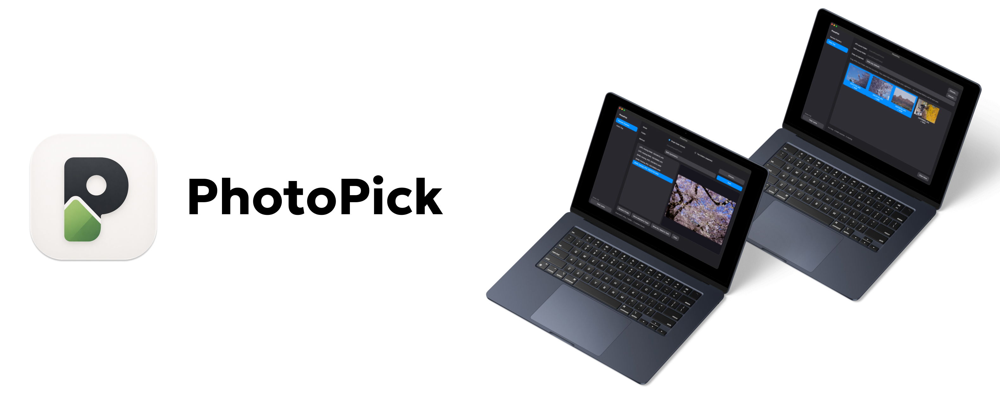

<div align="center">



# PhotoPick

**A macOS app for managing RAW + JPG photo pairs and pushing picks into Lightroom or another folder.**

</div>

---

## What it does

1. **Remove Orphans** — find (and optionally trash) RAW or JPG files that are missing their counterpart.
2. **Inbox Tray → Lightroom or another folder** — drop the JPGs you like onto a tray, then drag the matched RAW(s) straight into Lightroom or another folder.
3. A global **Clear cache** action for thumbnail previews.

Works on RAW from Canon, Nikon, Sony, Fuji, Pentax, Panasonic, Sigma, Olympus, and Adobe (`.cr2` `.cr3` `.nef` `.arw` `.dng` `.orf` `.rw2` `.pef` `.srw` `.x3f`), paired against `.jpg` / `.jpeg`.

---

## Install

Pre-built `.dmg` releases will be published on the [**GitHub Releases**](https://github.com/derekdylu/PhotoPick/releases) page. Until then, build from source — it's one command.

### Build from source

```bash
git clone https://github.com/derekdylu/PhotoPick.git
cd PhotoPick
./scripts/build_macos.sh
```

This produces:

- `dist/PhotoPick.app` — the bundled macOS app (~120 MB)
- `dist/PhotoPick-<version>.dmg` — a draggable installer (~50 MB)

First build takes ~3 min (most of it downloading PySide6 wheels); incremental rebuilds are ~30 s.

**Requirements**
- macOS (Apple Silicon or Intel)
- Python 3.10+ — the script auto-detects `python3.10`–`python3.13`; install with `brew install python@3.13` if you don't have one
- Xcode Command Line Tools (`xcode-select --install`)

### Run from source (no build)

```bash
pip install -r requirements.txt
python -m photopick.ui.app
# or
python photopick.py --gui
```

---

## First launch — macOS 擋下 "PhotoPick is damaged" / 「已損毀」/ "is malware"

PhotoPick 目前是 ad-hoc 簽章、沒有 Apple notarization。第一次打開時 macOS
(尤其 Sequoia 15.x) 很可能會跳出：

> "PhotoPick" is damaged and can't be opened. You should move it to the Trash.
> 「PhotoPick」已損毀，無法打開。您應該將其丟到垃圾桶。

這**不是**因為 app 真的有惡意 — 是 Gatekeeper 對沒有 Apple 簽章、又帶
quarantine 旗標的 app 的預設反應。你自己 build 出來的，或從本專案 Releases
下載的，都會是這個狀態。移除 quarantine 旗標即可：

```bash
# app 已拖到 /Applications
sudo xattr -dr com.apple.quarantine /Applications/PhotoPick.app

# app 還在 DMG / Downloads
xattr -dr com.apple.quarantine ~/Downloads/PhotoPick.app
```

然後正常雙擊開啟。這個指令只需要跑一次。

> **macOS Sequoia 提醒**：舊版「右鍵 → 打開」的繞過法在 Sequoia 上已經
> **失效** — 該對話框只有「移到垃圾桶」一個按鈕。請用上面的 `xattr`
> 指令，或到 **系統設定 → 隱私權與安全性**，滑到最下面會看到
> 「已封鎖 PhotoPick…」，點「**仍要打開**」。

### Developer ID signing (optional)

```bash
./scripts/build_macos.sh --sign "Developer ID Application: Your Name (TEAMID)"
xcrun notarytool submit dist/PhotoPick-<version>.dmg --apple-id ... --wait
```

---

## Features

### Remove Orphans

<p align="center"></p>

- **Mode**: *Single folder* (RAW + JPG mixed) or *Two folders* (RAW and JPG separate).
- **Comparison**:
  - `Anchor JPG` — RAWs with no matching JPG
  - `Anchor RAW` — JPGs with no matching RAW
  - `Both` — anything missing its counterpart
- The orphan list shows filenames only. Previews are loaded lazily on click — scrolling thousands of files costs nothing.
- `Reveal in Finder` and `Move to Trash` (via `send2trash` — never a permanent delete).

### Inbox Tray

<p align="center"></p>

- Pick a **RAW source folder**. Every dropped JPG is looked up by basename.
- **Drag JPGs in** from Finder, Preview, browsers, etc. Tiles are badged `✓ RAW` or `⚠ no RAW`.
- **Multi-select + drag out** onto Lightroom (import window or a watched folder).
- Configurable drag payload:
  - `RAW only` (default) — just the matched RAWs
  - `JPG only`
  - `Both`

### Clear cache

Removes `~/Library/Caches/PhotoPick/thumbs/`. Next preview re-decodes from source.

---

## CLI

No third-party deps for the CLI alone — `PySide6` / `rawpy` / etc. are only needed for the GUI.

```bash
# Single folder, anchor on JPG (default)
python photopick.py /path/to/photos

# Find orphans both directions
python photopick.py /path/to/photos --anchor both

# Two-folder mode
python photopick.py --jpg-dir /path/jpg --raw-dir /path/raw --anchor raw

# Actually delete (otherwise dry-run)
python photopick.py /path/to/photos --execute

# Launch the Mac app
python photopick.py --gui
```

---

## Repo layout

```
photopick/               # Python package
├── core/                # Pure-Python scanner/matcher/thumbs (no GUI deps)
│   ├── matcher.py
│   ├── scanner.py
│   └── thumbs.py
└── ui/                  # PySide6 Mac app
    ├── app.py
    ├── main_window.py
    ├── inbox_view.py
    ├── orphans_view.py
    └── styles.py

scripts/
├── build_macos.sh       # One-shot .app + .dmg build
└── _launcher.py         # PyInstaller entry point

PhotoPick.spec           # PyInstaller spec
assets/PhotoPick.icns    # App icon
```

---

## License

[MIT](LICENSE) © Derek Lu
